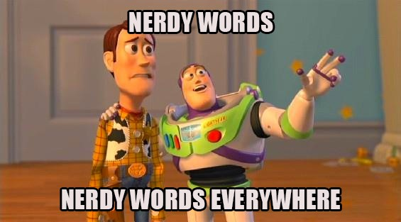

# Awesome list Dev Memes  

> A curated list of dev memes (including memes and gifs to approve/comment and request changes in a PR)

Just type <a href="http://bit.do/dev-memes">bit.do/dev-memes</a> to go here. Check out my <a href="https://pamepeixinho.github.io">site</a> and follow me on <a href="https://twitter.com/pamepeixinho">Twitter</a>.

## Contents

* [Coding process](#coding-process)
* [Pull Request (PR)](#pull-request-pr)
    * [Create PR](#create-pr)
    * [Reviewing PR](#reviewing-pr)
      * [Approve](#approve)
      * [Request Changes](#request-changes)
* [Contribute](#contribute)
* [License](#license)

## Coding process

About this section. Optional. Keep this short and focus on the list.

<!-- - [List item](http://example.com)
- [List item](http://example.com) -->

## Pull Request (PR)

### Create PR

<!-- - [List item](http://example.com)
- [List item](http://example.com) -->

### Reviewing PR

#### Approve

#### Request Changes

## Contribute

Contributions welcome! Read the [contribution guidelines](contributing.md) first.

## License

To the extent possible under law, [Pamela Peixinho](https://github.com/pamepeixinho) has waived all copyright and
related or neighboring rights to this work.
